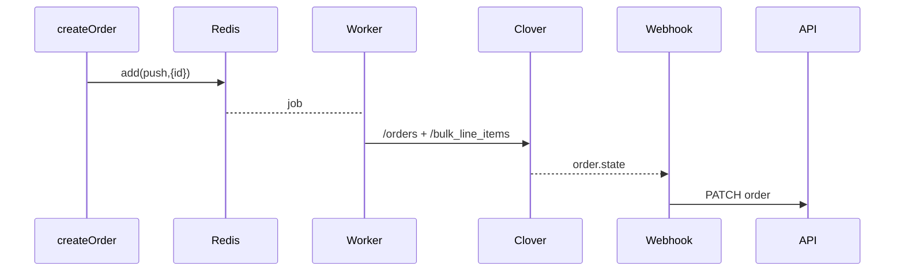

# 19 th Hole Restaurant & Bar — Full-Stack Platform  
**Live URL:** <https://carol-restaurant.vercel.app>  
**Tech Stack:** Next.js 15 · React 19 · TypeScript · Prisma/PostgreSQL · Tailwind + Bootstrap · NextAuth · Stripe · Clover POS · Cloudinary · Nodemailer · React-Query

---

## 📑 Table of Contents
1. [Vision](#vision)  6. [Folder Map](#folder-map)  
2. [Architecture](#architecture)  7. [Core Workflows](#core-workflows)  
3. [Prerequisites](#prerequisites)  8. [NPM Scripts](#npm-scripts)  
4. [Local Setup](#local-setup)  9. [Testing & Linting](#testing--linting)  
5. [Environment Vars](#environment-vars)  10. [CI · Cron](#ci--cron)  
                11. [Contributing](#contributing) 12. [License](#license)

---

## 🥅 Vision<a id="vision"></a>
*Single code-base* powering  
* **Public site** — menu, gallery, events, reservations.  
* **Omni-channel orders** — clubhouse pickup, on-course, delivery, cash or card.  
* **Role dashboards** — admin, staff, driver, cashier.  
* **Deep Clover POS sync** — menu, tax, stock, tenders, payouts.  
* **Mobile-first UX** — animations, offline-safe patterns, <200 ms live dashboard updates.

---

## 🔭 Architecture<a id="architecture"></a>

```mermaid
flowchart TD
  subgraph Browser
    A[Next.js App Router] --> B[React Contexts]
  end
  subgraph Vercel Functions
    C[/app/api/**] -->|Prisma| DB[(PostgreSQL)]
    C -->|queue| Q[Upstash Redis]
  end
  Q --> W[clover/pushOrder worker] --> Clover[Clover API]
  StripeWebhook --> C
  CloverWebhook --> C
  C --> Mail[Nodemailer]
  C --> Cloudinary
```

---

## 🛠 Prerequisites<a id="prerequisites"></a>

| Tool | Version | Why |
| --- | --- | --- |
| **Node** | ≥ v16 | uses `node:loader` |
| **PostgreSQL** | 14 + | Prisma DB |
| **Yarn / npm / pnpm** | current | lockfile = `package-lock.json` |
| **Clover API creds** | sandbox + prod | POS sync |
| **Stripe account** | any | event payments |
| **Cloudinary account** | free tier | images |

---

## ⚡ Local Setup<a id="local-setup"></a>

```bash
git clone https://github.com/Emkimotho/19th-hole-next.git
cd 19th-hole-next
cp .env.example .env.local   # fill secrets
npm i
npx prisma db push           # create schema
npm run seed                 # optional mock data
npm run dev
```

Browse **http://localhost:3000**

---

## 🔑 Environment Vars<a id="environment-vars"></a>

> Full list lives in `.env.example`

| Prefix | What for |
| --- | --- |
| `DATABASE_URL` | Postgres |
| `NEXTAUTH_*` | JWT sessions |
| `CLOVER_*` | POS sync, hosted checkout |
| `STRIPE_*` | ticketing payments |
| `CLOUDINARY_*` | image pipeline |
| `NEXT_PUBLIC_*` | safe for browser – tax %, base URL, etc. |

---

## 🗂 Folder Map<a id="folder-map"></a>

<details>
<summary><strong>Level&nbsp;1-3 tree</strong></summary>

```text
.
├─ app/                # App Router pages, layouts, API routes
│  ├─ (dashboard)/     # role-gated areas
│  ├─ menu/            # public menu pages (ISR)
│  ├─ api/             # serverless REST & webhooks
│  └─ ...
├─ components/         # reusable UI (+ Storybook stories)
├─ contexts/           # React 19 global state providers
├─ lib/                # Integrations (clover, stripe, email, queues)
│  └─ clover/          # ⬑ full POS sync layer
├─ prisma/             # schema + migrations + seed
├─ public/             # static assets (hero.mp4, icons)
└─ scripts/            # one-off CLI helpers
```
</details>

| Directory | Highlights |
| ----------| -----------|
| **`lib/clover/`** | Upstash queues, push/pull stock, hosted checkout builders. |
| **`contexts/`**   | `Cart`, `Order`, `Auth`, `OpeningHours`, `DeliveryCharges`. |
| **`middleware.ts`** | Edge auth/role guard for `/dashboard/**`. |

---

## 🚦 Core Workflows<a id="core-workflows"></a>

### 1&nbsp;· Authentication & RBAC
* NextAuth `credentials` provider → JWT with `roles[]`.  
* Edge middleware blocks unauthorised dashboards in ~1 ms.

### 2&nbsp;· Checkout (Card + Cash)
* **Card** → Stripe Checkout → webhook → `Order.status = PAID`.  
* **Cash** → Clover cash tender added during cashier reconcile.

### 3&nbsp;· Clover Sync


*Nightly cron (`vercel.json`) hits `/api/cron-stock` → refreshes stock.*

### 4&nbsp;· Stripe Ticketing
See [docs/architecture.md §7.4](#) for full sequence with QR email.

### 5&nbsp;· Real-Time Dashboards
Edge WebSocket hub `/api/orders/live` broadcasts json-patches → React Query cache updates in <200 ms.

---

## 📜 NPM Scripts<a id="npm-scripts"></a>

| Script | What it does |
| ------ | ------------ |
| `dev` | `next dev` + local ws server |
| `build / start` | production bundles |
| `lint / format` | ESLint + Prettier |
| `seed` | Prisma demo data |
| `ping:redis` | check Upstash quota |

---

## ✅ Testing & Linting<a id="testing--linting"></a>

* **Jest** + Testing-Library for units.  
* **Playwright** for E2E (GitHub Actions).  
* ESLint extends `next/core-web-vitals`, TypeScript in **strict** mode.

---

## 🚀 CI · Cron<a id="ci--cron"></a>

| Pipeline | Action |
| -------- | ------ |
| PR → *Preview* | lint + test → Vercel preview URL |
| `main` merge | auto-deploy prod → `prisma migrate deploy` |
| Nightly cron | 02 AM ET → `/api/cron-stock` |

---

## 🤝 Contributing<a id="contributing"></a>

1. Branch from `main`: `feat/<area>-<desc>`  
2. Keep PRs < 400 LOC; schema edits need squad review.  
3. `npm run lint && npm run test` must pass.  
4. Document decisions in `docs/adr/`.

---

## ⚖️ License<a id="license"></a>
MIT — see [`LICENSE`](LICENSE).

> *README curated & generated by Emilio Kimotho.*  
> _Happy hacking ⛳🪄_
